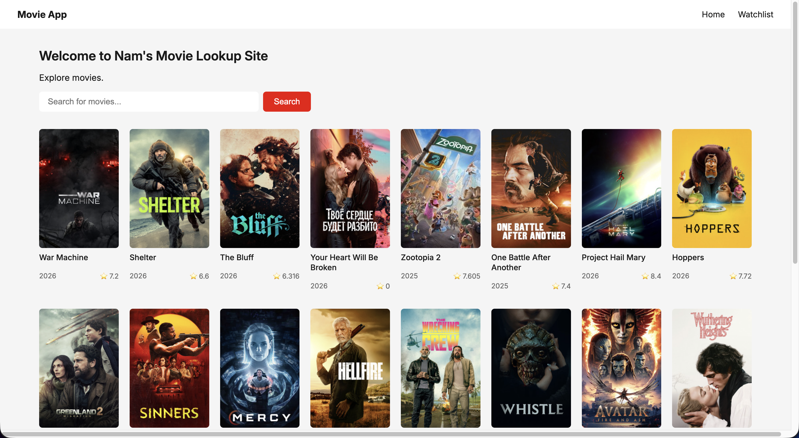
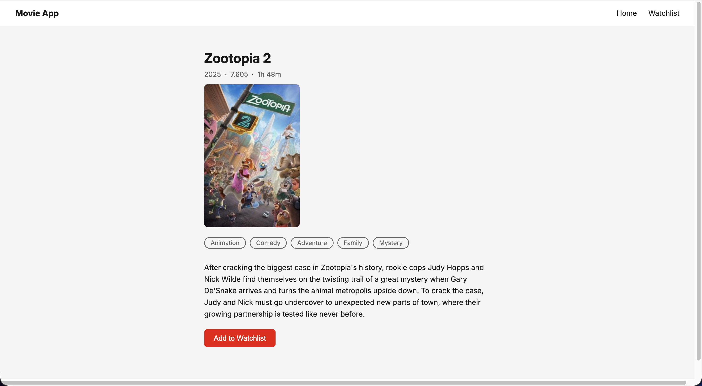
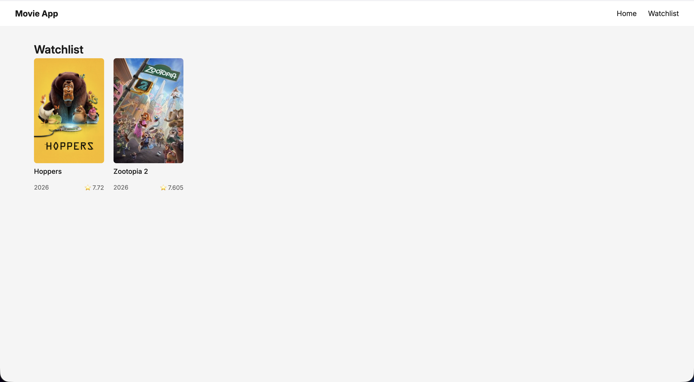
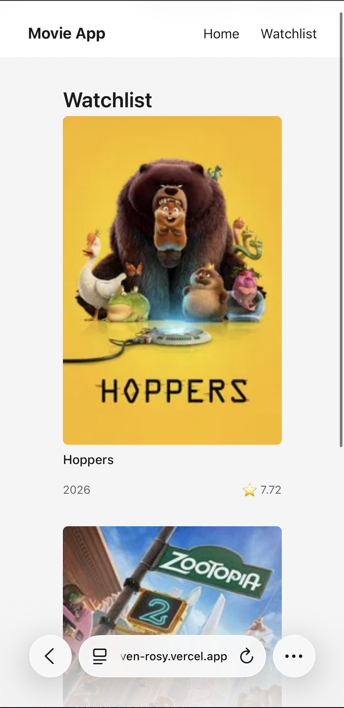

# Universal Movie Lookup

A full-stack movie search and watchlist app built with React, Express, and SQLite.

## Features
- Browse popular movies on load
- Search movies by title
- View movie details including genres, runtime, and overview
- Add and remove movies from a shared watchlist

## Tech Stack
- **Frontend:** React, Vite, React Router
- **Backend:** Node.js, Express
- **Database:** SQLite (better-sqlite3)
- **External API:** TMDB

## Limitations
- The watchlist is shared across all users — per-user watchlists require authentication
- The database resets on each Railway deployment — a persistent database (e.g. PostgreSQL) would be required for production use

## Endpoints
| Method | Endpoint | Description |
|--------|----------|-------------|
| GET | /movies/popular | Fetch popular movies |
| GET | /movies/search?query= | Search movies by title |
| GET | /movies/:id | Get movie details by TMDB id |
| GET | /watchlist | Get all saved movies |
| POST | /watchlist | Add a movie to watchlist |
| DELETE | /watchlist/:id | Remove a movie from watchlist |

## Future Features
- User authentication
- Per-user watchlists

## Screenshots

